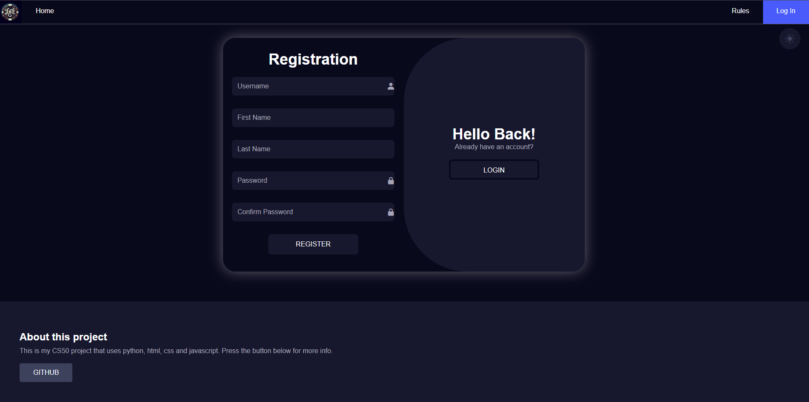
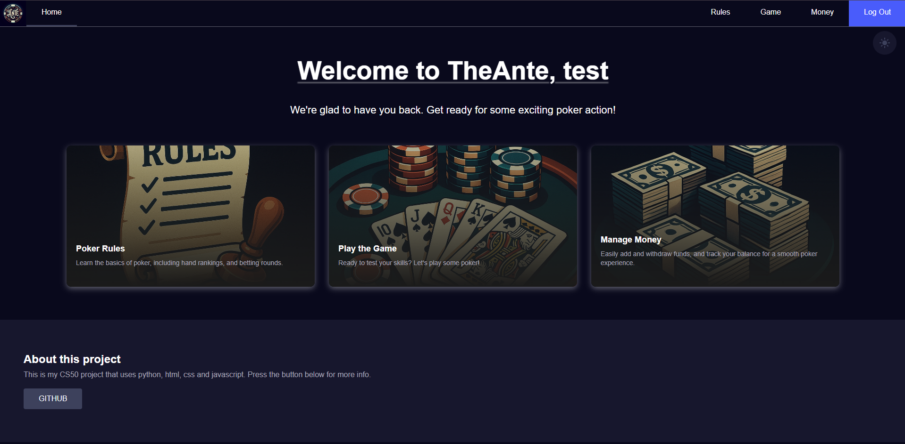
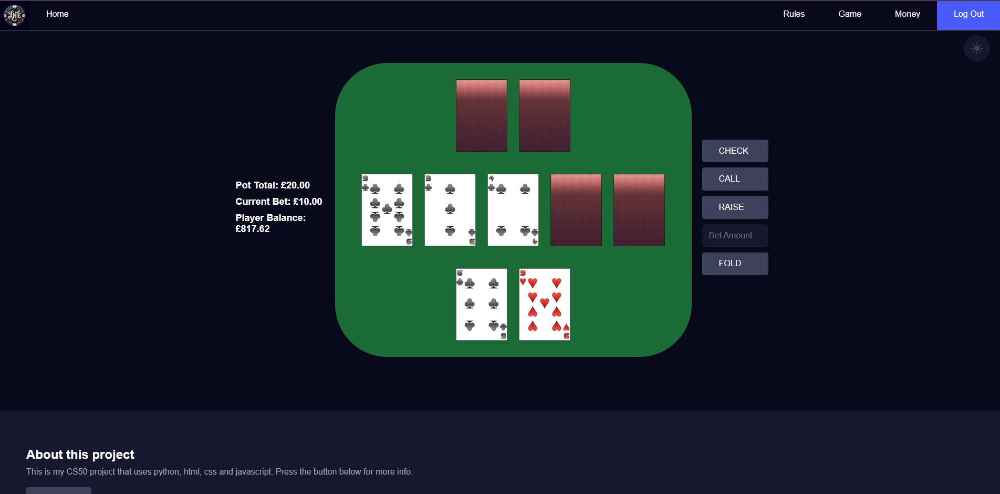
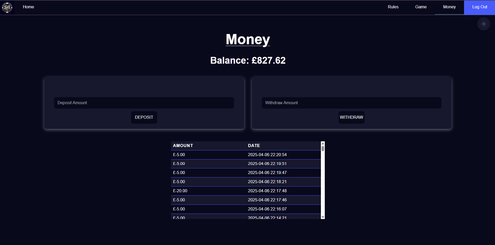

# Poker Project <!-- omit in toc -->

This is a poker website project that allows you to sign up, manage your money and play poker.


## Contents <!-- omit in toc -->

- [Demo](#demo)
- [Run Locally](#run-locally)
- [Features](#features)
- [Database Structure](#database-structure)
  - [1. **Table: `users`**](#1-table-users)
  - [2. **Table: `balance`**](#2-table-balance)
  - [3. **Table: `transactions`**](#3-table-transactions)
- [Usage/Examples](#usageexamples)
    - [Creating a Card](#creating-a-card)
    - [Creating a Hand](#creating-a-hand)
    - [Dealing a Table](#dealing-a-table)
    - [Evaluating a Hand](#evaluating-a-hand)
- [Screenshots](#screenshots)
- [Acknowledgements](#acknowledgements)


## Demo

[](https://youtube.com/embed/_cNUt9rsFgo)


## Run Locally

Clone the project

```bash
  git clone https://github.com/Agirunator/poker-project
```

Go to the project directory

```bash
  cd poker-project
```

Install dependencies

```bash
  pip install -r requirements.txt
```

Start the app

```bash
  python app.py
```


## Features

- Light/dark mode toggle
- Money management
- Poker game
- Accounts with sign up and log in

## Database Structure

This section outlines the SQL tables and their relationships. SQL is used in this project to handle users, logins and money management.

### 1. **Table: `users`**
   - **Description**: Stores information about the users.
   - **Primary Key**: 
     - `ID` (INTEGER): Unique identifier for each user, automatically incremented.
   - **Columns**:
     - `ID` (INTEGER): Primary key, auto-incremented.
     - `username` (TEXT): A unique identifier for the user. It must be alphanumeric, enforced by the `CHECK` constraint.
     - `password` (TEXT): The user's password (stored securely).
     - `first_name` (TEXT): The user's first name.
     - `last_name` (TEXT): The user's last name.
     - `created_at` (TIMESTAMP): The timestamp when the user was created. Defaults to the current time.
   - **Constraints**: 
     - `username` must be unique.
     - `username` must only contain alphanumeric characters, enforced by the `CHECK` constraint (`username GLOB '[A-Za-z0-9]*'`).

### 2. **Table: `balance`**
   - **Description**: Stores the balance for each user.
   - **Primary Key**: 
     - `USER_ID` (INTEGER): This is also the foreign key referencing the `ID` in the `users` table.
   - **Columns**:
     - `USER_ID` (INTEGER): Foreign key that references `users(ID)`. This creates a one-to-one relationship between the `users` and `balance` tables.
     - `balance` (REAL): The user's balance, defaulting to `0.0`.
   - **Foreign Key**:
     - `USER_ID` references the `ID` column in the `users` table.

### 3. **Table: `transactions`**
   - **Description**: Stores transaction details for each user.
   - **Primary Key**: 
     - `ID` (INTEGER): Unique identifier for each transaction.
   - **Columns**:
     - `ID` (INTEGER): Primary key, auto-incremented.
     - `USER_ID` (INTEGER): Foreign key that references the `users(ID)` table, linking each transaction to a user.
     - `amount` (REAL): The amount of the transaction (could be positive or negative depending on the transaction type).
     - `transaction_time` (TIMESTAMP): Timestamp for when the transaction occurred. Defaults to the current time.
   - **Foreign Key**: 
     - `USER_ID` references the `ID` column in the `users` table.


## Usage/Examples

#### Creating a Card

You can create a card using the `Card` class from the `cards` module:

```python
from packages.poker.cards import Card

# Create a card
card = Card(suit="Diamonds", rank="7")
print("Card:", card)
```

#### Creating a Hand

You can create a hand using the `Hand` class from the `cards` module:

```python
from packages.poker.cards import Card, Hand

# Create a hand
hand = Hand()
hand.add_card(Card(suit="Diamonds", rank="7"))
hand.add_card(Card(suit="Hearts", rank="Q"))

hand.display()
```

#### Dealing a Table

You can create and deal a table using the `Table` class from the `cards` module:

```python
from packages.poker.cards import Table, Deck

# Create a deck
deck = Deck()
deck.shuffle()

# Create a table
table = Table()
table.deal_flop(deck)
table.deal_turn(deck)
table.deal_river(deck)
table.display()
```

#### Evaluating a Hand

you can evaluate a hand using the `best_hand` function from the `eval` module:

```python
from packages.poker.eval import best_hand
from packages.poker.cards import Table, Deck, Hand
from packages.poker.gameplay import deal_table, deal_hands

# Create a deck
deck = Deck()
deck.shuffle()

# Create a table and hand
table = Table()
hand = Hand()

# Deal cards
deal_hands(deck, [hand])
deal_table(deck, table)

# Evaluate the hand
best_combination = best_hand(hand, table)

# Display the hand, table, and best combination
hand.display()
table.display()
best_combination["combination"].display()
```


## Screenshots







## Acknowledgements

- [Card Designs](https://opengameart.org/content/playing-cards-0)

